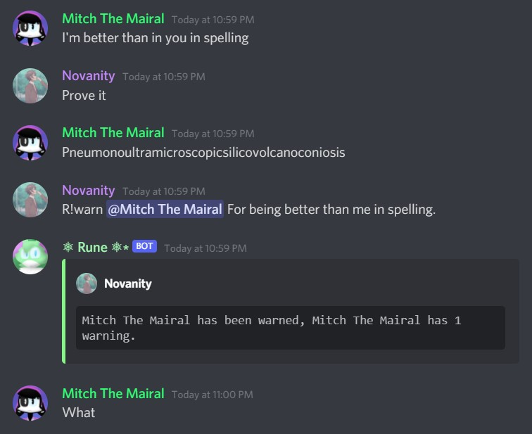
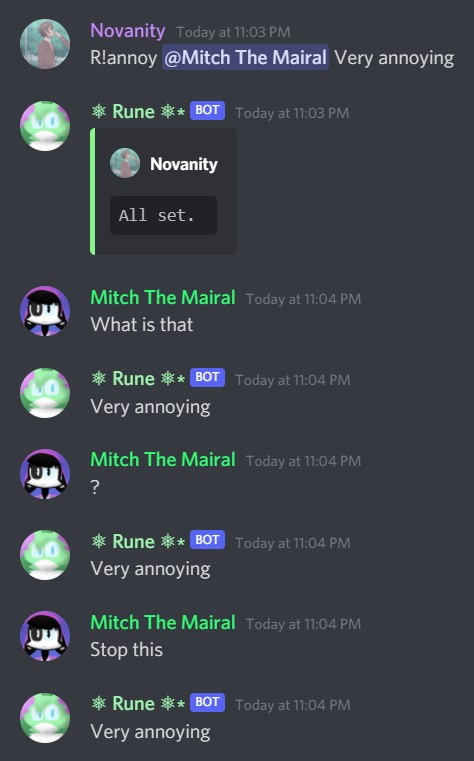

# Rune-Python

## Description
Rune is a bot that jokes around the server and also has a few features.

## About
Rune is now a small project for recreating a small amount of commands that i have in my bot named °Mitch°•.

Creator: `Novanity#1148`

- - -

## Date of Creation
11/25/20; November 25, 2021

## Date of Accomplishment
6/12/21; June 12, 2021

- - -

## Features
- OC/Character
    - 
- Warn System
    - 
- Annoy System
    - 

## Main Commands

- `R!help`
- `R!help moderation`
- `R!help oc`
- `R!invite`
- `R!ping`
- `R!say`
- `R!say-in`
- `R!say-to`
- `R!iq`
- `R!owofy`
- `R!clap-text`
- `R!sparkles-text`
- `R!sparkle-text`
- `R!eject`
- `R!compliment`
- `R!insult`
- `R!flirt`
- `R!roast`
- `R!joke`

- - -

## Updates

- ### May 2, 2021
    - The Recreation of JSON as a Database in Python has been cancelled; Characters Feature has been cancelled.

- ### May 7, 2021
    - The Recreation of JSON as a Database in Python has been recontinued, and the reasons are:
        - I've researched more and deep into the vast of internet.
        - I figured out and found more tricks to make this as simple like Javascript.
        - Started to study more about Classic Python.

- ### June 12, 2021
    - Rune is now finished, i still might update Rune, but for now i got to go finish my other projects.
